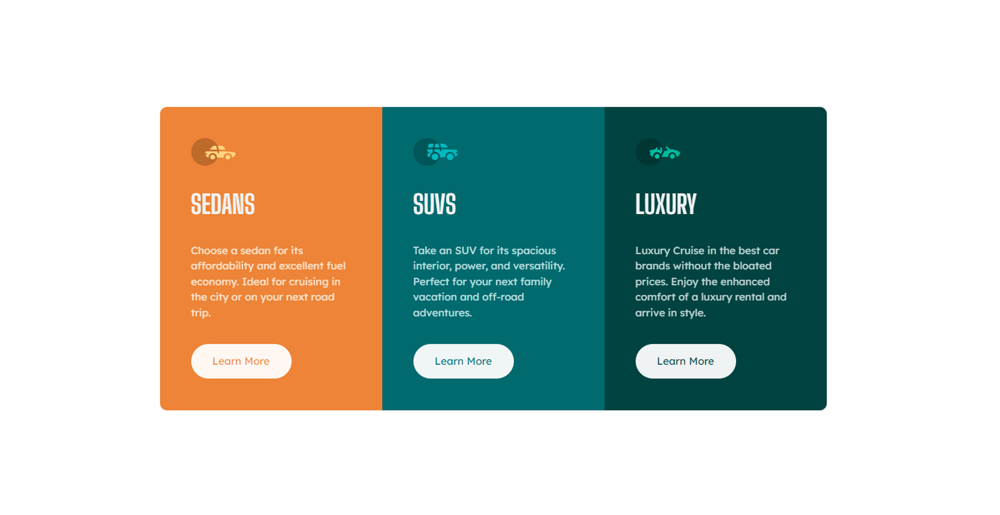

# Frontend Mentor - 3-column preview card component solution

This is a solution to the [3-column preview card component challenge on Frontend Mentor](https://www.frontendmentor.io/challenges/3column-preview-card-component-pH92eAR2-). Frontend Mentor challenges help you improve your coding skills by building realistic projects.

## Table of contents

- [Overview](#overview)
  - [The challenge](#the-challenge)
  - [Screenshot](#screenshot)
  - [Links](#links)
- [My process](#my-process)
  - [Built with](#built-with)
  - [What I learned](#what-i-learned)
  - [Continued development](#continued-development)
  - [Useful resources](#useful-resources)
- [Author](#author)
- [Acknowledgments](#acknowledgments)

**Note: Delete this note and update the table of contents based on what sections you keep.**

## Overview

### The challenge

Users should be able to:

- View the optimal layout depending on their device's screen size
- See hover states for interactive elements

### Screenshot

### Links

- Solution URL: [https://github.com/FabricioRivera2021/3-column-preview-card-component-main](https://github.com/FabricioRivera2021/3-column-preview-card-component-main)
- Live Site URL: [https://fabriciorivera2021.github.io/3-column-preview-card-component-main/](https://fabriciorivera2021.github.io/3-column-preview-card-component-main/)

## My process

In this case i follow a process from mobile first to desktop.

### Built with

- Semantic HTML5 markup
- CSS custom properties
- Flexbox
- Mobile-first workflow

### What I learned

I practices a lot with the pseudoelemnts after to set the background color of my layout.

## Author

- Frontend Mentor - [@FabricioRivera2021](https://www.frontendmentor.io/profile/FabricioRivera2021)
- Github - [FabricioRivera2021](https://github.com/FabricioRivera2021)
